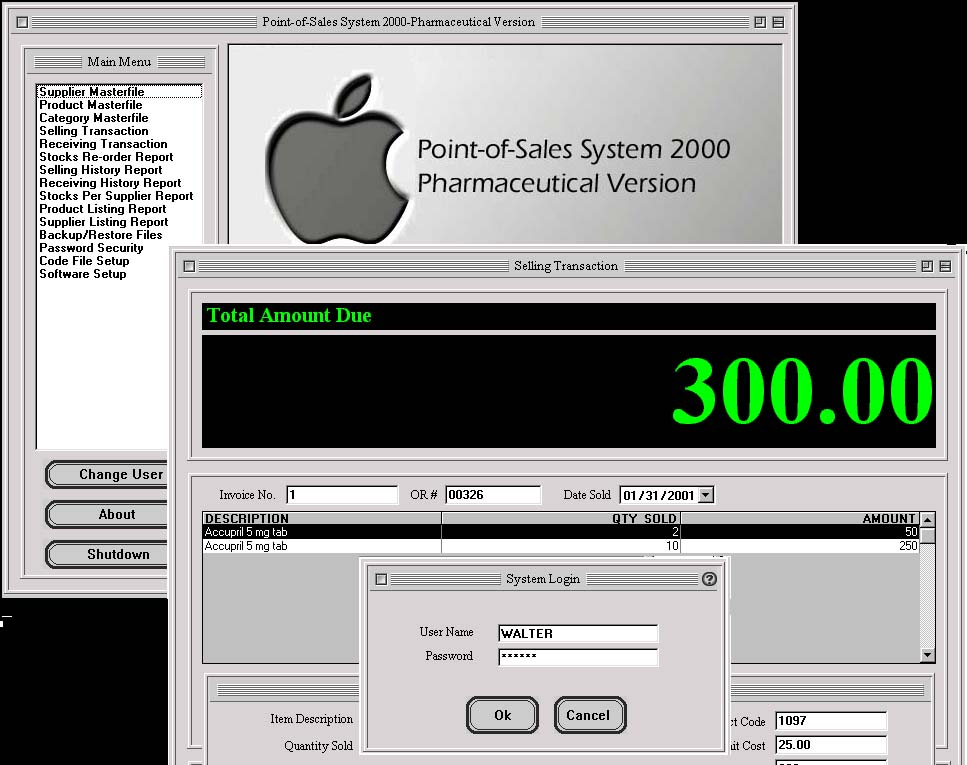



## COMPLETE CASH REGISTER & INVENTORY APPLICATION with COOL GUI/MAC SKIN\(a must see\.\.\)

### Description

This is a complete application, cash register & inventory program/point-of-sales monitoring that is customized for a drug store/pharmaceutical company. It has many capabilities such as: Login Security, Selling Transaction, Receiving Transaction, Multiple reports using Crystal Reports Version 7, etc. and much of all a "Cool GUI Skin from Mac Skin". This will be the best ever and the most complete application in P.S.C. This is very easy to learn. PLEASE DON'T FORGET TO VOTE FOR IT.
 
### More Info
 
Please register the ANIGIF.OCX to the "c:\WINDOWS\SYSTEM" directory using the method REGSVR32 ANIGIF.OCX at the RUN menu or just right click mouse from windows explorer and simply register it right away. This is a free GIF Animator that i used in the CASH REGISTER & INVENTORY program.

             |
---                |---
**Submitted On**   |2001-02-01 02:44:34
**By**             |[Walter Narvasa](https://github.com/Planet-Source-Code/PSCIndex/blob/master/ByAuthor/walter-narvasa.md)
**Level**          |Advanced
**User Rating**    |4.7 (548 globes from 116 users)
**Compatibility**  |VB 6\.0
**Category**       |[Databases/ Data Access/ DAO/ ADO](https://github.com/Planet-Source-Code/PSCIndex/blob/master/ByCategory/databases-data-access-dao-ado__1-6.md)
**World**          |[Visual Basic](https://github.com/Planet-Source-Code/PSCIndex/blob/master/ByWorld/visual-basic.md)
**Archive File**   |[CODE\_UPLOAD143861312001\.zip](https://github.com/Planet-Source-Code/walter-narvasa-complete-cash-register-inventory-application-with-cool-gui-mac-skin-a-must-__1-14890/archive/master.zip)

